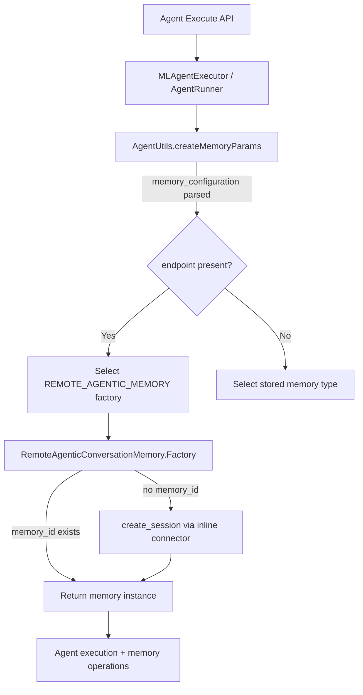
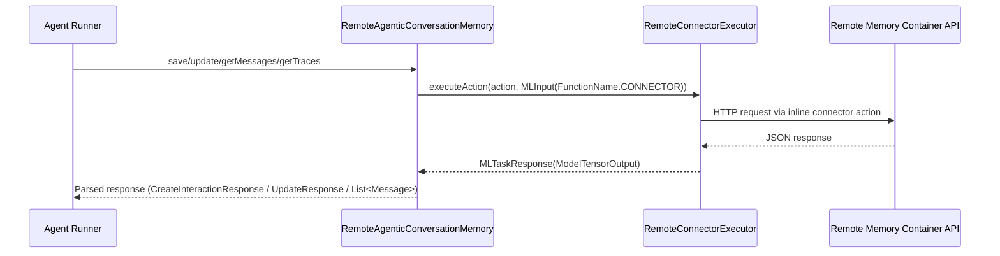

# Remote Agentic Conversation Memory

## Background
Agentic memory in ML Commons traditionally relies on transport actions that operate on local/system indices (via `AgenticConversationMemory`). For remote storage scenarios, this introduces two gaps:
- The agent execution API may only have **inline connector metadata** (endpoint/region/credential) at runtime, without a stored connector id.
- The memory operations must hit **remote memory container REST APIs** instead of local indices.

Remote Agentic Conversation Memory fills that gap by building a connector **in-memory** during agent execution and using it to call the memory container REST APIs directly. This keeps the memory container remote while preserving agent runtime flows such as session creation, message save, trace retrieval, and updates.

## Service Overview
Remote Agentic Conversation Memory is a `Memory` implementation registered under `MLMemoryType.REMOTE_AGENTIC_MEMORY`. It is selected dynamically when inline memory connector metadata is present at agent execution time.

Key behaviors:
- **Inline metadata intake**: `AgentUtils.createMemoryParams` parses `memory_configuration` and pulls out `memory_endpoint`, `region`, `credential`, and optional `role_arn`, along with `memory_container_id` and `user_id`.
- **Factory selection override**: Agent runners and `MLAgentExecutor` switch to `REMOTE_AGENTIC_MEMORY` when `memoryParams` contains `endpoint`, regardless of the agent’s stored memory type.
- **Inline connector execution**: `RemoteAgenticConversationMemory` constructs an inline connector (AWS SigV4 or HTTP) with memory-container actions:
  - `create_session`
  - `add_memory`
  - `search_memories`
  - `get_memory`
  - `update_memory`
- **Response parsing**: Uses the memory response classes (`MLAddMemoriesResponse`, `MLGetMemoryResponse`) and `UpdateResponse` parsing to stay consistent with the REST payloads.
- **Retry logic**: Update flow uses retry/backoff for AOSS refresh latency and transient errors.

## High-Level Design

### Components
- **Memory type definition**: `MLMemoryType.REMOTE_AGENTIC_MEMORY`.
- **Factory registration**: `MachineLearningPlugin` registers `RemoteAgenticConversationMemory.Factory` in `memoryFactoryMap`.
- **Runtime selection**:
  - `MLAgentExecutor` and agent runners (`MLChatAgentRunner`, `MLConversationalFlowAgentRunner`, `MLPlanExecuteAndReflectAgentRunner`) switch memory type when inline metadata is detected.
- **Inline connector construction** (`RemoteAgenticConversationMemory.Factory`):
  - Validates `memory_container_id` and `endpoint`.
  - Builds an `AwsConnector` (if region + credential are present) or `HttpConnector`.
  - Adds memory-container actions with URL templates using `${parameters.*}` placeholders.
  - If no `memory_id` is provided, calls `create_session` first and returns a memory instance bound to the new session id.
- **Execution engine**:
  - Uses `RemoteConnectorExecutor` (loaded via `MLEngineClassLoader`) with `FunctionName.CONNECTOR`.
  - Binds `scriptService`, `clusterService`, `client`, and `xContentRegistry`.

### API Contracts (Inputs)
`AgentUtils.createMemoryParams` expects these fields:
- `memory_container_id` (required)
- `memory_configuration` (JSON)
  - `memory_endpoint`
  - `region`
  - `credential` (map) or `role_arn`
  - `user_id` (optional)

### Memory Operations
The remote memory instance mirrors `AgenticConversationMemory` behaviors:
- **save** → `add_memory` (writes working memory entry)
- **getMessages** → `search_memories` (filters by session id, excludes traces)
- **getTraces** → `search_memories` (filters by parent message id + trace type)
- **update** → `get_memory` then `update_memory` (with retries)

## Data Flow Diagrams

### 1) Agent Execution With Inline Remote Memory Configuration


### 2) Remote Memory Operation (Save / Update / Search)


### 3) Update With Retry (AOSS Compatibility)
```mermaid
flowchart TD
    U[update(messageId)] --> G[get_memory]
    G --> P[parse structured_data]
    P --> M[merge update_content]
    M --> X[update_memory]
    X -->|success| Done[UpdateResponse]
    X -->|retryable error| R[backoff + retry]
    G -->|retryable error| R
    R --> G
```

## Notes and Current Behavior
- Inline connector metadata is **runtime-only**; it is not persisted in the memory container.
- The memory container id is still required; remote memory only replaces how the storage layer is reached, not the container concept.
- `RemoteAgenticConversationMemory` currently treats all updates as working-memory updates and uses retry logic similar to the local agentic memory implementation.
- Search pipeline support is carried through `RemoteMemoryStoreHelper` for remote store integrations, but the inline memory connector builds its own request payloads for memory APIs.

## Key Files
- `ml-algorithms/src/main/java/org/opensearch/ml/engine/memory/RemoteAgenticConversationMemory.java`
- `ml-algorithms/src/main/java/org/opensearch/ml/engine/algorithms/agent/MLAgentExecutor.java`
- `ml-algorithms/src/main/java/org/opensearch/ml/engine/algorithms/agent/MLChatAgentRunner.java`
- `ml-algorithms/src/main/java/org/opensearch/ml/engine/algorithms/agent/MLConversationalFlowAgentRunner.java`
- `ml-algorithms/src/main/java/org/opensearch/ml/engine/algorithms/agent/MLPlanExecuteAndReflectAgentRunner.java`
- `ml-algorithms/src/main/java/org/opensearch/ml/engine/algorithms/agent/AgentUtils.java`
- `plugin/src/main/java/org/opensearch/ml/plugin/MachineLearningPlugin.java`
