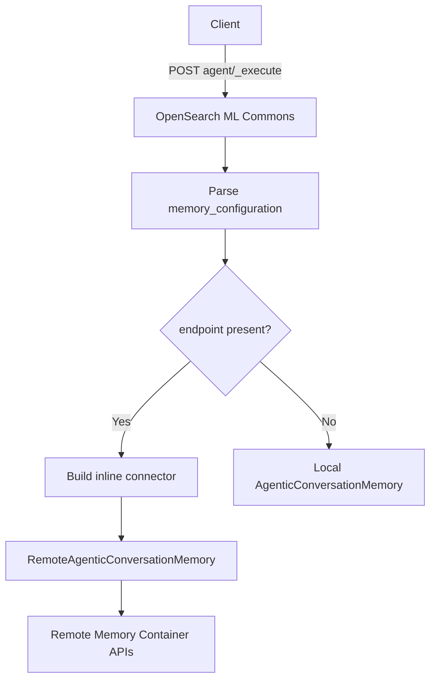
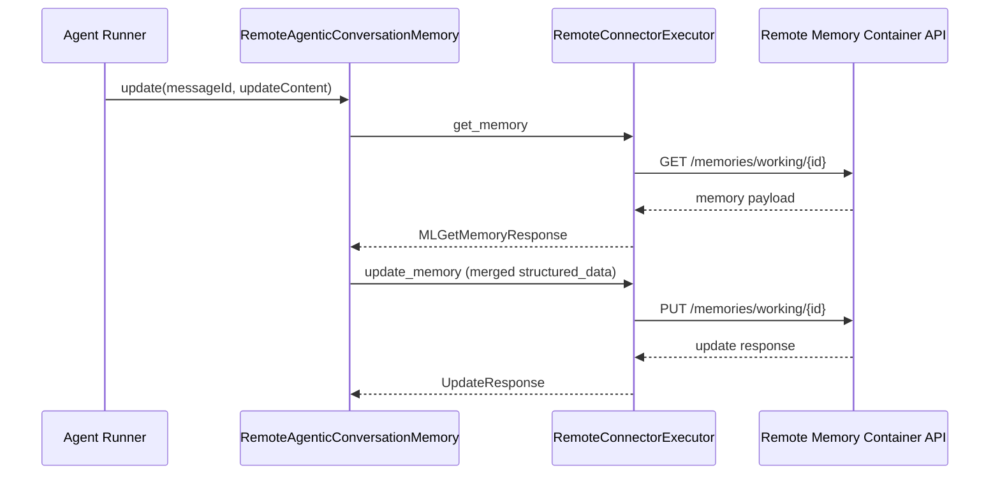

# Remote Agentic Conversation Memory Threat Model

# Introduction

## Purpose
A threat model answers: What are we working on? What can go wrong? What are we going to do about it? Did we do a good job? This document models the security risks for Remote Agentic Conversation Memory (RACM), which enables agent execution to use **remote** memory containers via **inline connector metadata** at runtime.

## Project background
Agentic memory in ML Commons originally writes to local/system indices using transport actions. For remote deployments, the agent execution API may only have runtime connector metadata (endpoint/region/credential) without a persisted connector id. Remote Agentic Conversation Memory adds a memory implementation that constructs an **inline connector** at execution time, and calls the remote memory container REST APIs to store/retrieve messages, traces, and updates.

## Service overview
RACM is a `Memory` implementation registered as `REMOTE_AGENTIC_MEMORY`. It is selected dynamically when `memory_configuration` (containing endpoint/credential/region) is present in agent execution parameters. RACM creates an inline connector and uses `RemoteConnectorExecutor` with `FunctionName.CONNECTOR` to call:
- `create_session`
- `add_memory`
- `search_memories`
- `get_memory`
- `update_memory`

The inline connector is **not persisted**. Credentials are supplied at runtime and are intended to remain ephemeral.

## Security tenets
- **Data privacy and isolation:** Conversation data and extracted memories must be isolated per user/tenant and per container.
- **Data integrity:** Remote memory records must not be tampered with or overwritten by unauthorized callers.
- **Least privilege:** Inline credentials must be scoped to only the remote memory container APIs required.
- **Secure by default:** Runtime metadata and credentials should not leak into unrelated agent tooling or logs.

## Assumptions

| ID | Assumption | Comments |
| --- | --- | --- |
| A-01 | AWS SigV4 and IAM authorization are trusted for remote OpenSearch/AOSS access. | |
| A-02 | TLS is correctly configured between the OpenSearch node and remote endpoint. | |
| A-03 | The Security Plugin enforces agent/connector API authorization in the local cluster. | |
| A-04 | Remote memory container endpoints enforce access controls independently of the local cluster. | |
| A-05 | Inline credentials are scoped and short‑lived (STS/role‑based) where possible. | |

## Admin
- **Design docs:** `Remote_Agentic_Conversation_Memory_Overview.md`, `Agentic_Memory_Integration.md`, `Access_Control_Design_on_Agentic_Memory.md`

# System Architecture

## High‑level design
```
Agent Execute API
    |
    v
MLAgentExecutor / AgentRunner
    |
    +-- AgentUtils.createMemoryParams (parses memory_configuration)
    |
    +-- Select REMOTE_AGENTIC_MEMORY (if endpoint present)
           |
           v
RemoteAgenticConversationMemory.Factory
    |
    +-- Build inline connector (endpoint/region/credential)
    +-- create_session (optional)
           |
           v
RemoteAgenticConversationMemory
    |
    +-- add_memory / get_memory / update_memory / search_memories
           |
           v
Remote Memory Container APIs (OpenSearch / AOSS)
```

## Data stores and boundaries
- **Local OpenSearch cluster**: Runs agent execution and connector execution.
- **Remote OpenSearch/AOSS cluster**: Hosts memory containers and working/long-term/history indices.
- **Runtime metadata**: `memory_configuration` is passed with the agent execution request.

Trust boundaries:
1. External client → OpenSearch ML Commons REST API
2. OpenSearch node → Remote memory container endpoint

# Data Flow Diagrams

### 1) Agent execution with inline remote memory


### 2) Remote memory update flow


# Assets

| Asset | Usage | Sensitivity |
| --- | --- | --- |
| Memory container data | Working/trace messages, long‑term facts | High (may include PII) |
| Inline connector credentials | Runtime only, used to sign remote requests | High (secrets) |
| Remote endpoint | Target OpenSearch/AOSS API URL | Medium |
| Agent execution parameters | Contains memory configuration | Medium/High |
| Local cluster logs | Debug/trace output | Medium |

# Threat Actors
- External attacker with network access to ML Commons APIs
- Tenant user with access to agent execution
- Insider with development or operational permissions

# Security Anti‑Patterns (relevant)
- **Secret in request parameters**: Inline credentials passed through agent execution parameters risk leakage.
- **Unvalidated remote endpoints**: Runtime‑provided endpoints can enable SSRF or data exfiltration.
- **Shared parameter map**: Memory configuration mixed into agent parameters can bleed into unrelated connector calls.

# Threats (STRIDE)

| ID | STRIDE | Threat | Impact | Mitigation / Notes |
| --- | --- | --- | --- | --- |
| T-01 | Spoofing | Use another tenant’s `memory_container_id` to access their memory | Unauthorized access | Enforce container access checks and tenant ownership before memory ops. |
| T-02 | Spoofing | Supply a malicious endpoint to impersonate remote memory service | Data exfiltration | Validate endpoint allowlist / trusted domains; disallow private IPs unless explicitly enabled. |
| T-03 | Tampering | Modify memory records via crafted update payloads | Data integrity loss | Validate update schema; restrict update fields; enforce RBAC on container. |
| T-04 | Tampering | Man‑in‑the‑middle on remote calls | Corrupt data / leakage | Require TLS and certificate validation to remote endpoint. |
| T-05 | Repudiation | Lack of audit trail for remote memory changes | Hard to trace abuse | Ensure memory history index or API logs capture changes and caller context. |
| T-06 | Information Disclosure | Inline credentials leak through logs or downstream tool params | Credential compromise | Scrub/avoid logging credential fields; isolate memory params from agent tool params. |
| T-07 | Information Disclosure | Remote memory responses returned to unauthorized caller | PII leakage | Enforce security plugin RBAC and container ownership checks. |
| T-08 | DoS | Large or repeated memory updates against remote endpoint | Resource exhaustion | Rate limiting; retry backoff; size limits on payloads. |
| T-09 | DoS | Retry loops amplify remote outage | Cascading failure | Cap retries and backoff; fail fast on non‑retryable errors. |
| T-10 | Elevation of Privilege | Inline credentials used to access other remote OpenSearch resources | Data breach | Use scoped IAM role; restrict connector action URLs to memory APIs. |
| T-11 | Elevation of Privilege | Shared execution params override LLM connector credentials | Unauthorized remote access | Separate memory configuration from agent runtime params; avoid cross‑connector parameter leakage. |

# Mitigations Summary
- Endpoint allowlist / private IP guard for inline connectors.
- Strict RBAC checks on memory container access before remote calls.
- Credential scrubbing (`removeCredential`) and logging redaction.
- Parameter scoping: isolate memory configuration from general agent/tool parameters.
- Retry caps and backoff with clear non‑retryable error handling.
- Use short‑lived IAM role credentials for remote memory access.

# Open Questions / Gaps
- How to enforce strong endpoint validation for runtime‑provided URLs without breaking legitimate private endpoints?
- How to centralize memory parameter scoping so LLM connectors never see memory credentials?
- Should remote memory operations be auditable in the local cluster (task index) beyond remote history indices?
