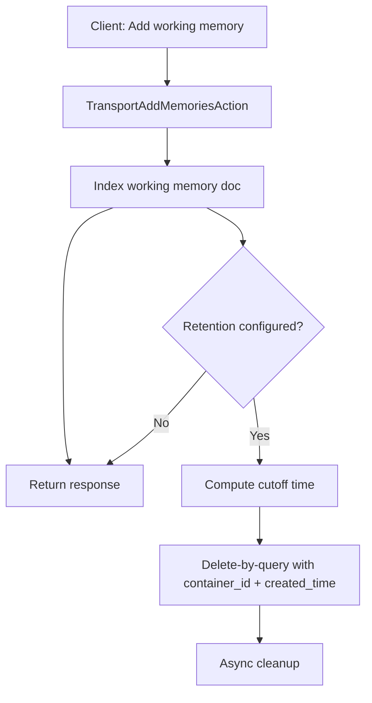
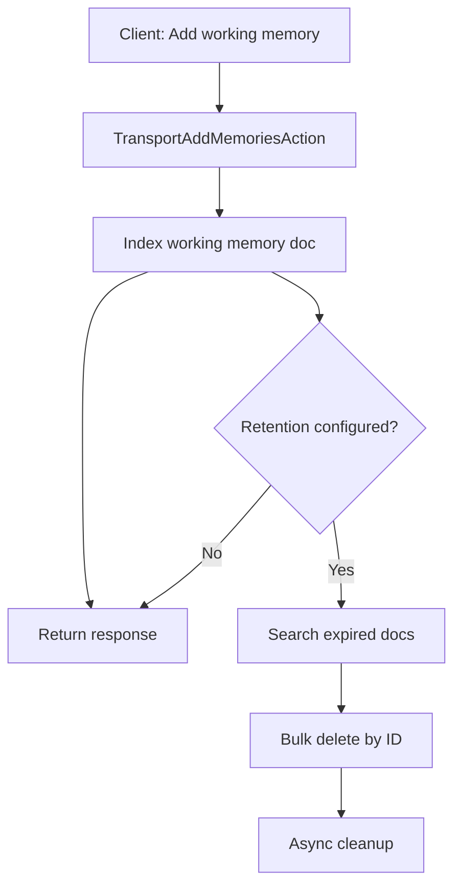
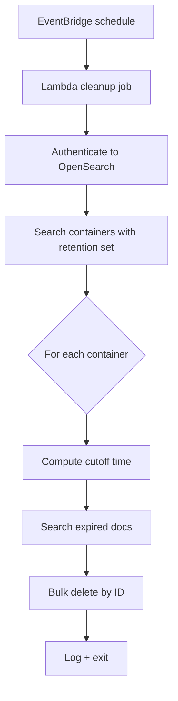
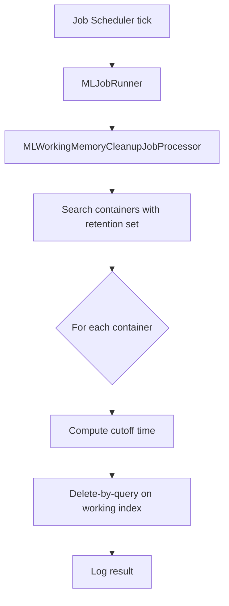
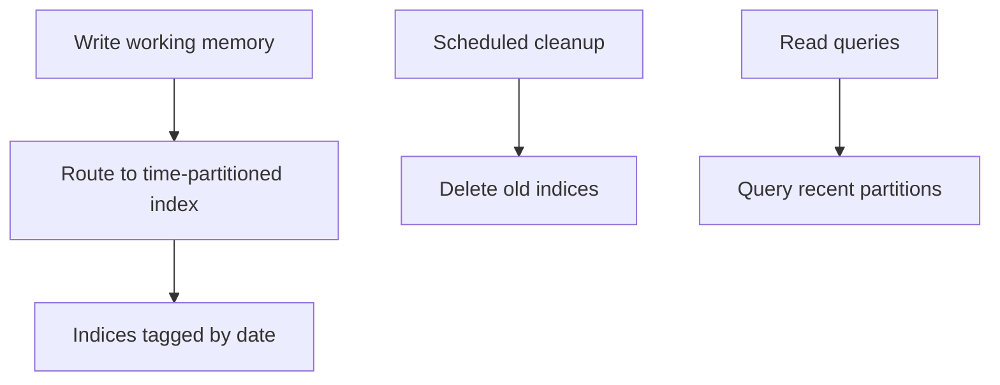

# Working Memory Cleanup Design

## Problem statement
Working memory in agentic memory containers grows without a retention policy. Users need a way to automatically remove working memory entries older than a user-specified maximum retaining time (days).

## Current status
- Working memory documents already store `created_time` and `last_updated_time` and are mapped as `date` fields in `common/src/main/resources/index-mappings/ml_memory_working.json`.
- Memory container configuration lives in `MemoryConfiguration` and is stored in `.plugins-ml-am-memory-container` with mapping in `common/src/main/resources/index-mappings/ml_memory_container.json`.
- Delete-by-query is supported for memory indices via `TransportDeleteMemoriesByQueryAction` and executed safely for system indices through `MemoryContainerHelper`.
- A cluster-manager scheduled job exists (`MLSyncUpCron`) and is scheduled from `MLCommonsClusterManagerEventListener`. It currently focuses on model routing/state consistency and runs on a configurable interval.

## Functional requirements
- Add a new per-container configuration field: `working_memory_retention_days`.
- Accept only positive integer values when set; `null` or `-1` means "retain forever".
- Cleanup must only delete documents belonging to the target container (filter on `memory_container_id`).
- Cleanup must work for both system indices and non-system indices.
- Cleanup should not block normal request flow; any asynchronous work must be bounded and observable.

## Options

### Option A: Dedicated cluster-manager sweeper
Schedule a new `MemoryRetentionCron` from `MLCommonsClusterManagerEventListener` with its own interval setting. The sweeper scans containers with retention configured and runs delete-by-query against each container's working memory index.

Pros:
- Clean separation of responsibilities and tunable cadence.
- Works even when containers are idle.
- Centralized logging and operational control.

Cons:
- Adds a new scheduler and setting to maintain.
- Requires a container scan (potentially heavy if many containers).

### Option B: Opportunistic cleanup on write (preferred)
When a working memory entry is added (e.g., in `TransportAddMemoriesAction`), run an asynchronous delete-by-query for that container if `working_memory_retention_days` is configured.

Pros:
- Minimal new infrastructure.
- Naturally scales with write volume; no extra periodic jobs.
- Simple to implement and reason about in the add-memory path.

Cons:
- Idle containers are never cleaned.
- Adds background work on hot paths; must be throttled to avoid spikes.
- Deletes are eventually consistent and may lag behind actual retention time.

#### Data flow (Option B)
1. Client calls `POST /_plugins/_ml/memory_containers/{id}/memories`.
2. `TransportAddMemoriesAction` loads the container and writes the working memory document.
3. If `working_memory_retention_days` is configured:
   - Compute `cutoff = now - retention_days`.
   - Build a delete-by-query with:
     - `memory_container_id` filter
     - `created_time < cutoff`
   - Execute delete-by-query asynchronously using `MemoryContainerHelper.deleteDataByQuery`.
4. Request returns immediately; cleanup completes in the background.

#### Data flow diagram (Option B)

### Option G: Opportunistic cleanup on write without delete-by-query
Attempt cleanup on each write without using delete-by-query by first searching for expired documents and then deleting them by ID in bulk.

Pros:
- Avoids delete-by-query API usage if that is a concern for some deployments.
- Can cap deletion volume per write for predictable load.

Cons:
- Still requires a search query to discover expired documents, so overall cost is similar or worse than delete-by-query.
- Two-step search + bulk delete is more complex and can miss races.
- Hard to guarantee full cleanup without repeated scans.

Feasibility:
- Technically feasible but inferior to delete-by-query; adds complexity with minimal benefit.

#### Data flow (Option G)
1. Client calls `POST /_plugins/_ml/memory_containers/{id}/memories`.
2. `TransportAddMemoriesAction` writes the working memory document.
3. If `working_memory_retention_days` is configured:
   - Compute `cutoff = now - retention_days`.
   - Search for expired docs with:
     - `memory_container_id` filter
     - `created_time < cutoff`
   - Bulk delete found doc IDs.
4. Request returns immediately; cleanup runs asynchronously.

#### Data flow diagram (Option G)

### Option C: Query-time expiry + manual cleanup
Filter out expired working memory at read time by adding a `created_time` range filter in search/get paths. Storage cleanup is manual or ad-hoc.

Pros:
- No background jobs or write-path overhead.
- Users never see expired data.

Cons:
- Storage continues to grow without manual cleanup.
- Requires consistent filter use across all read paths.

### Option D: ISM policy per working memory index
Attach an ISM (Index State Management) policy to each working memory index that deletes the entire index when it passes the retention period.

Pros:
- Offloads cleanup to OpenSearch index lifecycle engine.
- Efficient at scale for dedicated per-container indices.

Cons:
- Not feasible for shared indices; ISM cannot delete per-container subsets.
- Requires careful handling for system indices and policy updates.

### Option H: AWS EventBridge + Lambda cleanup (external)
Use EventBridge Scheduler to trigger a Lambda on a fixed interval to scan memory indices and delete expired documents.

Pros:
- Fully offloads cleanup scheduling and execution from OpenSearch nodes.
- Scales independently with AWS compute.

Cons:
- Requires network access to the cluster, IAM credentials, and external operational ownership.
- Adds additional failure modes and latency between cluster and cleanup job.
- Requires careful security and audit controls.

Feasibility:
- Feasible if the cluster is reachable from Lambda (public endpoint or VPC integration) and IAM/credentials are managed safely.

#### Data flow (Option H)
1. EventBridge triggers Lambda on a fixed interval (e.g., daily).
2. Lambda authenticates to the OpenSearch cluster.
3. Lambda queries memory containers with retention configured.
4. For each container:
   - Compute `cutoff = now - retention_days`.
   - Search for expired docs with:
     - `memory_container_id` filter
     - `created_time < cutoff`
  - Bulk delete found doc IDs.
5. Lambda logs results and exits.

#### Data flow diagram (Option H)

### Option E: Reuse Sync-Up Cron
Add a retention sweep step inside `MLSyncUpCron` or piggyback on its schedule. Use a coarse "last sweep" guard to avoid running every 10 seconds.

Pros:
- Minimal new scheduling infrastructure.
- Centralized execution on cluster-manager node.

Cons:
- Coupled to model sync cadence and lifecycle.
- Default interval is too frequent; needs gating logic.
- Mixed responsibilities can make operations harder to debug.

### Option F: Job Scheduler cleanup (preferred)
Use the Job Scheduler framework to run a periodic cleanup job. The job scans memory containers with `working_memory_retention_days` configured and runs delete-by-query for each container's working memory index.

Pros:
- Uses an existing distributed scheduler with locking and persistence.
- Clear operational control via a job definition and interval schedule.
- Avoids coupling to model sync cadence.

Cons:
- Requires new job type, processor, and job creation wiring.
- Needs a global interval setting and careful multi-tenant scanning.
- Cleanup is periodic and may lag behind real-time retention.

#### Data flow (Option F)
1. Job Scheduler triggers `MLJobRunner` for `WORKING_MEMORY_CLEANUP`.
2. `MLWorkingMemoryCleanupJobProcessor` searches `.plugins-ml-am-memory-container` for containers with retention configured.
3. For each container:
   - Compute `cutoff = now - retention_days`.
   - Execute delete-by-query on the working memory index with:
     - `memory_container_id` filter
     - `created_time < cutoff`
4. Job completes and logs results; next run follows the schedule.

#### Data flow diagram (Option F)

### Option J: Time-partitioned working memory indices
Write working memory into time-partitioned indices (e.g., per day or week) and delete entire indices once they are older than the retention window.

Pros:
- Deletes are index-level and efficient.
- Avoids per-document delete costs for large volumes.

Cons:
- Requires index aliasing or routing changes in the write/read paths.
- Complicates shared index prefixes and per-container isolation.
- Additional operational complexity for index lifecycle management.

Feasibility:
- Feasible but requires substantial changes to indexing and query plumbing.

#### Data flow (Option J)
1. Write path routes working memory to a time-partitioned index (e.g., `...-working-2026.02.03`).
2. Read path queries the active time partitions within the retention window.
3. A scheduled cleanup deletes whole indices older than the retention threshold.

#### Data flow diagram (Option J)

