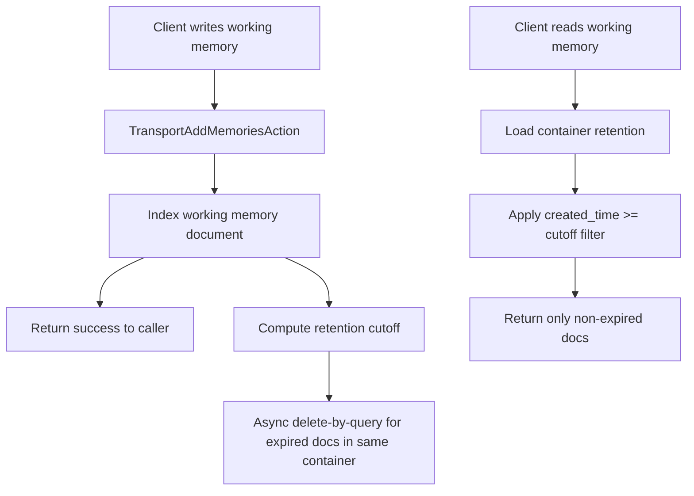
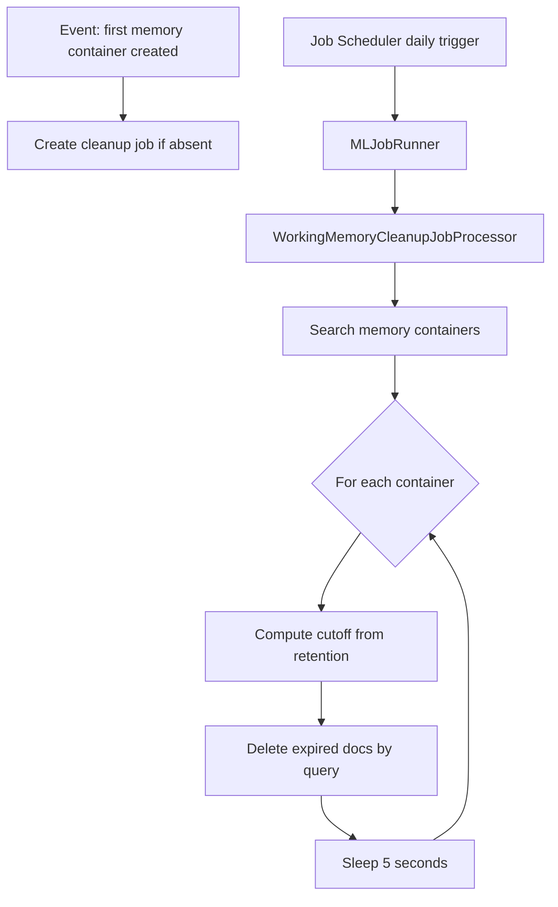

# RFC: Working Memory Retention for Agentic Memory

- **Status**: Draft
- **Authors**: TBD
- **Reviewers**: TBD
- **Created**: 2026-03-19
- **Tracking Issue**: TBD

## Summary

This RFC proposes adding retention and cleanup for working memory in agentic memory containers.

The rollout is intentionally staged:

1. **Stage 1** uses **Option B + Option C**:
   - **Option B**: opportunistic cleanup on write using asynchronous delete-by-query
   - **Option C**: query-time expiry filtering so expired documents are hidden immediately from read APIs

2. **Stage 2** uses **Option F**:
   - add a dedicated **Job Scheduler** cleanup job to physically reclaim expired documents for all containers, including idle containers

This staged approach gives us immediate user-visible correctness in Stage 1 with limited implementation risk, while Stage 2 adds durable background reclamation and better long-term operational behavior.

## Problem Statement

Working memory currently grows without a retention policy. Users need a way to automatically expire working memory entries after a configurable number of days.

Without retention:
- storage can grow indefinitely
- stale working memory remains queryable unless manually deleted
- operational cleanup depends on ad hoc intervention

We need a retention design that:
- supports per-container retention configuration
- hides expired data from reads
- eventually deletes expired documents from storage
- works with the current memory container and working memory implementation
- can be rolled out incrementally with low risk

## Goals

- Add a per-container retention control for working memory.
- Make expired working memory invisible to read APIs.
- Physically delete expired working memory documents over time.
- Keep the first implementation simple and low risk.
- Reuse existing internal infrastructure where practical.

## Non-Goals

- Multi-tenancy handling in this iteration.
- Retention for long-term memory, session memory, or history memory.
- Re-architecting working memory storage into a different index layout.
- Introducing index partitioning in the first two stages.

## Current State

Today:
- working memory documents store `created_time` and `last_updated_time`
- working memory is stored in a dedicated working memory index per memory container configuration
- delete-by-query support already exists in the memory code path
- there is no retention-aware filtering in memory read APIs
- there is no scheduled cleanup for expired working memory

## Proposal

## Retention Model

Add a new field to memory container configuration:

- `working_memory_retention_days`

Behavior:
- default retention is **90 days**
- maximum retention is **365 days**
- retention is evaluated against **`created_time`**
- retention applies only to **working memory**

## Why a staged rollout

We do not need to wait for a full scheduled cleanup framework to deliver value.

Stage 1 gives us:
- immediate correctness for users by hiding expired docs at read time
- lightweight best-effort physical cleanup on active containers
- minimal new scheduling infrastructure

Stage 2 adds:
- cleanup for idle containers
- predictable daily reclamation
- centralized control and observability through Job Scheduler

## Stage 1: Option B + Option C

Stage 1 combines:
- **Option B**: opportunistic cleanup on write
- **Option C**: query-time expiry filtering

### Stage 1 behavior

### 1. Query-time expiry filtering
All working-memory read paths should exclude expired documents by adding a retention filter based on the container’s effective retention.

Effective cutoff:
- `cutoff = now - working_memory_retention_days`

Query filter:
- `memory_container_id == <container_id>`
- `created_time >= cutoff`

This ensures expired working memory is not returned even if it still exists physically in the index.

### 2. Opportunistic cleanup on write
When a new working memory entry is added:
- write the new working memory document
- asynchronously trigger cleanup for the same container
- cleanup uses delete-by-query with:
  - `memory_container_id == <container_id>`
  - `created_time < cutoff`

This keeps active containers reasonably clean without introducing a scheduler in Stage 1.

### Why combine B and C

Using only Option B leaves a correctness gap:
- if a container becomes idle, expired documents remain visible until the next write

Using Option C closes that gap:
- expired documents are hidden immediately from reads
- physical cleanup becomes a storage optimization, not a correctness dependency

### Stage 1 data flow

### Stage 1 advantages

- low implementation risk
- no new scheduler required
- immediate user-visible correctness
- cleanup cost is naturally correlated with write activity

### Stage 1 limitations

- idle containers are not physically cleaned up
- cleanup work is added to hot write paths, even if asynchronous
- storage reclamation is best-effort rather than guaranteed

## Stage 2: Option F

Stage 2 introduces a dedicated Job Scheduler cleanup job.

### Stage 2 behavior

Add a new Job Scheduler job that:
- runs every **24 hours**
- scans all memory containers
- identifies containers with effective retention
- executes delete-by-query for expired working memory in each container
- sleeps **5 seconds** between containers to avoid usage spikes

This scheduled job becomes the durable storage-reclamation mechanism.

### Job lifecycle

The cleanup job should start lazily:
- create or enable the job when the **first memory container** is successfully created
- use idempotent job creation so concurrent container creation does not create duplicates

### Stage 2 data flow

### Stage 2 advantages

- cleans idle containers
- predictable daily reclamation
- uses existing Job Scheduler infrastructure
- operationally cleaner than piggybacking on write traffic

### Stage 2 limitations

- adds scheduler-specific plumbing
- reclamation is periodic rather than immediate
- introduces container-scan overhead once per run

## API and Data Model Changes

## Memory container configuration

Add to container configuration:
- `working_memory_retention_days`

Validation:
- minimum: `1`
- maximum: `365`
- default if absent: `90`

## Effective retention semantics

If a container does not explicitly set `working_memory_retention_days`, the system uses:
- `effective_retention_days = 90`

This default applies to:
- query-time filtering
- opportunistic cleanup on write
- scheduled cleanup in Stage 2

## Read-path changes

Working-memory read APIs should apply retention filtering automatically.

Relevant paths include:
- get working memory
- search working memory
- any other read path that returns working memory documents

## Write-path changes

When working memory is added:
- persist the document as today
- asynchronously start a cleanup task for expired docs in the same container

## Detailed Design

## Stage 1 implementation details

### Query-time filtering
Read handlers should:
1. load the memory container
2. resolve effective retention
3. compute cutoff
4. add a `created_time >= cutoff` filter for working memory reads

This filter should be applied centrally where possible to avoid inconsistent behavior across endpoints.

### Opportunistic cleanup
Write handler should:
1. index the working memory document
2. schedule async cleanup work
3. execute delete-by-query for expired docs in that container

Important properties:
- cleanup must not block the main write response
- failures should be logged but should not fail the write request
- cleanup should always scope by `memory_container_id`

## Stage 2 implementation details

### Job type
Add a new job type for working memory cleanup.

### Job schedule
- interval: **24 hours**

### Startup rule
Start the job only after the first memory container exists.

### Per-container throttling
After cleaning one container:
- sleep **5 seconds**
- then continue to the next container

This reduces risk of query and delete spikes during a single run.

## Backward Compatibility

This proposal is backward compatible.

- Existing containers without `working_memory_retention_days` will use the default **90-day** retention.
- Existing working memory documents do not require reindexing or schema migration.
- Query-time filtering in Stage 1 changes visible behavior but is aligned with the new retention contract.
- Stage 2 only affects physical deletion of documents already considered expired by policy.

## Operational Considerations

## Observability
We should log:
- container ID
- effective retention days
- cutoff time
- deleted document count
- failures

We should expose metrics where practical:
- cleanup runs
- containers scanned
- documents deleted
- cleanup failures
- cleanup duration

## Failure handling
- Stage 1 cleanup failures should not fail writes.
- Stage 2 failures for one container should not stop the entire run.
- Missing indices or missing containers should be logged and skipped.

## Performance
- Stage 1 adds small async overhead to writes for active containers.
- Stage 2 adds predictable daily scan and delete load.
- The 5-second per-container delay intentionally trades throughput for cluster safety.

## Security
- Cleanup queries must always include `memory_container_id`.
- This iteration does not address multi-tenancy.
- Internal job execution should use internal system access, not end-user permissions.

## Alternatives Considered

### Option A: Dedicated cluster-manager sweeper
Viable, but Job Scheduler is a cleaner long-term home for periodic cleanup.

### Option D: ISM policy per working memory index
Efficient for whole-index retention, but weak for per-container document-level retention in shared layouts.

### Option E: Reuse sync-up cron
Possible, but couples unrelated responsibilities and inherits an awkward lifecycle.

### Option G: Opportunistic cleanup on write without delete-by-query
Feasible, but search-plus-bulk-delete is more complex than delete-by-query and usually not better.

### Option H: EventBridge + Lambda
Feasible, but introduces external infrastructure and cross-system operational complexity.

### Option J: Time-partitioned working memory indices
Potentially strong long-term architecture, but requires much larger write/read path changes than needed here.

## Rollout Plan

### Phase 1
Implement:
- `working_memory_retention_days`
- default retention of 90 days
- max retention of 365 days
- query-time expiry filtering
- opportunistic async cleanup on write

### Phase 2
Implement:
- Job Scheduler cleanup job
- first-container lazy startup
- 24-hour schedule
- 5-second pause between containers

## Testing Strategy

## Unit tests
- retention field parsing and validation
- default retention behavior
- cutoff calculation
- read-path retention filter injection
- write-path async cleanup trigger
- job-runner dispatch for cleanup job

## Integration tests
- expired docs are hidden from reads in Stage 1
- active containers reclaim expired docs on writes
- idle containers are reclaimed in Stage 2 by scheduled cleanup
- first container creation starts the cleanup job
- job respects 24-hour schedule configuration
- cleanup scopes deletes to the target container

## Open Questions

- Should retention continue to use `created_time`, or should we support `last_updated_time` in the future?
- Do we want a feature flag to enable query-time filtering independently from physical cleanup?
- Do we want container-level overrides for cleanup cadence in the future, or should cadence remain global?
