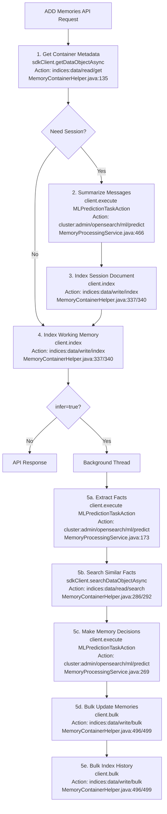

# ADD Memories API - Client and Action Calls Investigation

## Executive Summary

**Total Client Calls:** 10 types across different scenarios
**Total SdkClient Calls:** 3 types
**Execution Model:** All operations are asynchronous using ActionListener or CompletableFuture patterns

---

## 1. Action Names Mapping

### 1.1 ML Commons Custom Actions

#### MLPredictionTaskAction
- **Action NAME:** `"cluster:admin/opensearch/ml/predict"`
- **File:** `common/src/main/java/org/opensearch/ml/common/transport/prediction/MLPredictionTaskAction.java`
- **Usage:** 3 times in ADD Memories API
  - Line 173: Extract facts from conversation
  - Line 269: Make memory decisions
  - Line 466: Summarize messages for session

```java
public class MLPredictionTaskAction extends ActionType<MLTaskResponse> {
    public static final String NAME = "cluster:admin/opensearch/ml/predict";
    public static final MLPredictionTaskAction INSTANCE = new MLPredictionTaskAction();
}
```

#### MLExecuteConnectorAction
- **Action NAME:** `"cluster:admin/opensearch/ml/connectors/execute"`
- **File:** `common/src/main/java/org/opensearch/ml/common/transport/connector/MLExecuteConnectorAction.java`
- **Usage:** Remote storage operations (AOSS/remote OpenSearch)
  - RemoteStorageHelper.java lines: 307, 351, 383, 417, 459, 491, 532

```java
public class MLExecuteConnectorAction extends ActionType<MLExecuteConnectorResponse> {
    public static final String NAME = "cluster:admin/opensearch/ml/connectors/execute";
    public static final MLExecuteConnectorAction INSTANCE = new MLExecuteConnectorAction();
}
```

### 1.2 OpenSearch Core Actions

#### IndexAction (via client.index())
- **Action NAME:** `"indices:data/write/index"`
- **Underlying Class:** `org.opensearch.action.index.IndexAction`
- **Usage:** MemoryContainerHelper.java:337 (system index), 340 (regular index)
- **Purpose:** Index session documents, working memory documents

```java
// Client convenience method
client.index(IndexRequest, ActionListener)
// Internally calls:
client.execute(IndexAction.INSTANCE, IndexRequest, ActionListener)
// Where IndexAction.NAME = "indices:data/write/index"
```

#### BulkAction (via client.bulk())
- **Action NAME:** `"indices:data/write/bulk"`
- **Underlying Class:** `org.opensearch.action.bulk.BulkAction`
- **Usage:** MemoryContainerHelper.java:496 (system index), 499 (regular index)
- **Purpose:** Bulk operations on long-term memory and history records

```java
// Client convenience method
client.bulk(BulkRequest, ActionListener)
// Internally calls:
client.execute(BulkAction.INSTANCE, BulkRequest, ActionListener)
// Where BulkAction.NAME = "indices:data/write/bulk"
```

### 1.3 SdkClient Operations (System Index Wrapper)

#### GetAction (via sdkClient.getDataObjectAsync())
- **Action NAME:** `"indices:data/read/get"`
- **Underlying Class:** `org.opensearch.action.get.GetAction`
- **Usage:** MemoryContainerHelper.java:135
- **Purpose:** Get memory container configuration

#### SearchAction (via sdkClient.searchDataObjectAsync())
- **Action NAME:** `"indices:data/read/search"`
- **Underlying Class:** `org.opensearch.action.search.SearchAction`
- **Usage:** MemoryContainerHelper.java:286, 292, 818
- **Purpose:** Search for similar facts, count containers

---

## 2. Client Calls Detail

### 2.1 ML Prediction Operations

| Operation | Location | Method | Purpose | Parameters | When |
|-----------|----------|--------|---------|------------|------|
| **Session Summarization** | MemoryProcessingService.java:466 | `client.execute(MLPredictionTaskAction.INSTANCE, predictionRequest, listener)` | Generate summary of conversation for new session | LLM model ID, SESSION_SUMMARY_PROMPT, conversation JSON | No session_id provided |
| **Fact Extraction** | MemoryProcessingService.java:173 | `client.execute(MLPredictionTaskAction.INSTANCE, predictionRequest, listener)` | Extract semantic facts/preferences from conversation | LLM model ID, strategy-specific prompt, conversation JSON | Background processing if infer=true |
| **Memory Decision Making** | MemoryProcessingService.java:269 | `client.execute(MLPredictionTaskAction.INSTANCE, predictionRequest, listener)` | Decide whether to ADD/UPDATE/DELETE memories | LLM model ID, DEFAULT_UPDATE_MEMORY_PROMPT, old memories + new facts JSON | Background processing if infer=true and facts found |

### 2.2 Index Operations

| Operation | Location | Method | Index | Purpose | When |
|-----------|----------|--------|-------|---------|------|
| **Session Document** | MemoryContainerHelper.java:337/340 | `client.index(indexRequest, listener)` | `{prefix}_session` | Create session document | No session_id provided |
| **Working Memory** | MemoryContainerHelper.java:337/340 | `client.index(indexRequest, listener)` | `{prefix}_working_memory` | Store raw conversation messages | Always (every ADD memories call) |
| **Error History** | MemoryContainerHelper.java:337/340 | `client.index(indexRequest, listener)` | `{prefix}_long_memory_history` | Record processing errors | On background processing failures |

### 2.3 Bulk Operations

| Operation | Location | Method | Index | Purpose | When |
|-----------|----------|--------|-------|---------|------|
| **Long-Term Memory** | MemoryContainerHelper.java:496/499 | `client.bulk(bulkRequest, listener)` | `{prefix}_long_memory` | Execute ADD/UPDATE/DELETE decisions | After memory decisions made |
| **Memory History** | MemoryContainerHelper.java:496/499 | `client.bulk(bulkRequest, listener)` | `{prefix}_long_memory_history` | Audit trail of all operations | After executing memory operations |

### 2.4 Connector Operations (Remote Storage)

| Operation | Location | Method | Actions | When |
|-----------|----------|--------|---------|------|
| **Remote Storage Ops** | RemoteStorageHelper.java:307 | `client.execute(MLExecuteConnectorAction.INSTANCE, request, listener)` | `write_document`, `search_index`, `bulk_load` | When `memoryConfig.getRemoteStore().getConnectorId()` configured |

---

## 3. SdkClient Calls Detail

| Operation | Location | Method | Index | Purpose | Returns |
|-----------|----------|--------|-------|---------|---------|
| **Get Container** | MemoryContainerHelper.java:135 | `sdkClient.getDataObjectAsync(getDataObjectRequest)` | `.ml-memory-container` | Retrieve memory container configuration | CompletableFuture |
| **Search Similar Facts** | MemoryContainerHelper.java:286/292 | `sdkClient.searchDataObjectAsync(searchRequest)` | `{prefix}_long_memory` | Find existing similar memories | CompletableFuture |
| **Count Containers** | MemoryContainerHelper.java:818 | `sdkClient.searchDataObjectAsync(countRequest)` | `.ml-memory-container` | Validate index prefix uniqueness | CompletableFuture |

---

## 4. Complete Execution Flow



---

## 5. Action Names Summary Table

| Client Method | Action Class | Action NAME | Count | Purpose |
|--------------|--------------|-------------|-------|---------|
| `client.execute(MLPredictionTaskAction.INSTANCE)` | MLPredictionTaskAction | `cluster:admin/opensearch/ml/predict` | 3 | LLM inference |
| `client.execute(MLExecuteConnectorAction.INSTANCE)` | MLExecuteConnectorAction | `cluster:admin/opensearch/ml/connectors/execute` | 8+ | Remote storage |
| `client.index()` | IndexAction | `indices:data/write/index` | 2 | Index documents |
| `client.bulk()` | BulkAction | `indices:data/write/bulk` | 2 | Bulk operations |
| `sdkClient.getDataObjectAsync()` | GetAction | `indices:data/read/get` | 1 | Get container |
| `sdkClient.searchDataObjectAsync()` | SearchAction | `indices:data/read/search` | 3 | Search data |